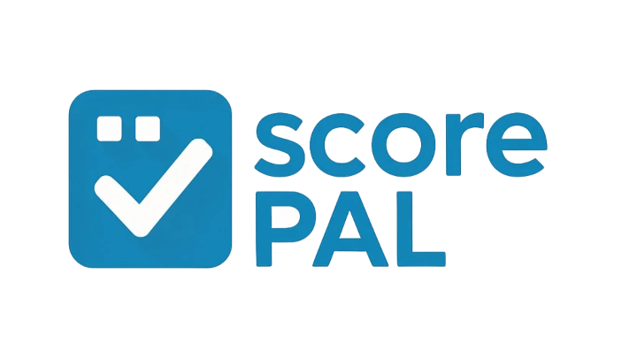

<div align="center">



# ScorePAL - AI-Powered Academic Grading

[](https://github.com/Dead-Stone/ScorePAL)
[](LICENSE)
[](https://python.org)
[](https://nextjs.org)
[](https://github.com/Dead-Stone/ScorePAL/releases)

### ✨ Grade assignments 10x faster with AI - Built for educators, by educators

🚧 **Beta Release** - Expect bugs and frequent updates as we improve the platform

</div>

---

## ✨ Grade for Free

Notebooks are beginner friendly. Read our guide. Add your assignment files, click "Grade", and export your results to CSV, Canvas, or PDF reports.

| ScorePAL supports | Free Notebooks | Performance | Memory use |
|-------------------|----------------|-------------|------------|
| **Essays & Reports** | [▶️ Start grading](https://github.com/Dead-Stone/ScorePAL/blob/main/examples/essay_grading.md) | 10x faster | 80% less manual work |
| **Python Code** | [▶️ Start grading](https://github.com/Dead-Stone/ScorePAL/blob/main/examples/python_grading.md) | 5x faster | Auto syntax check |
| **Jupyter Notebooks** | [▶️ Start grading](https://github.com/Dead-Stone/ScorePAL/blob/main/examples/jupyter_grading.md) | 8x faster | Cell-by-cell analysis |
| **Canvas Integration** | [▶️ Start grading](https://github.com/Dead-Stone/ScorePAL/blob/main/examples/canvas_integration.md) | Seamless | Direct gradebook sync |

---

## What is ScorePAL?

ScorePAL revolutionizes academic grading by using Google's Gemini AI to automatically grade written assignments and programming submissions with human-level accuracy. Upload student work, define your rubric, and get detailed feedback in minutes instead of hours.

> ⚠️ **Beta Notice**: This is our first open source release. While core functionality is stable, you may encounter bugs. Please report issues on GitHub!

### 🚀 Key Features

- ⚡ **Lightning Fast**: Grade entire classes in minutes
- 🎯 **Consistent Scoring**: Eliminate grading bias with AI consistency  
- 📝 **Detailed Feedback**: Get comprehensive comments for each criterion
- 💻 **Programming Support**: Grade Python code and Jupyter notebooks
- 🔗 **Canvas Integration**: Direct LMS workflow integration
- 📊 **Rich Analytics**: Track student performance trends
- 🎨 **Custom Rubrics**: Create reusable scoring frameworks

---

## 📱 Application Overview

### 🏠 Home Dashboard
Your central hub for all grading activities with quick access to single submissions, batch grading, and Canvas integration.

### 📝 Grading Interface
**Single Mode**: Upload question paper + student submission → Get instant AI grading
**Batch Mode**: Upload ZIP of submissions → Grade entire class simultaneously

### 🎓 Canvas Integration (Beta)
Connect directly to your Canvas courses:
1. Browse your courses and assignments
2. Sync student submissions automatically  
3. Grade with custom rubrics
4. Post results back to Canvas gradebook

### 📋 Rubric Builder
- **AI Generation**: Describe your assignment → Get auto-generated rubric
- **Manual Creation**: Build custom scoring criteria with multiple performance levels
- **Template Library**: Reuse rubrics across assignments

### 📊 Analytics Dashboard
- Grade distribution visualizations
- Student performance tracking
- Rubric effectiveness analysis
- Export reports for administrators

---

## ⚡ Quick Start

```bash
# Clone and setup
git clone https://github.com/Dead-Stone/ScorePAL.git
cd ScorePAL

# Install dependencies
pip install -r backend/requirements.txt
cd frontend && npm install && cd ..

# Add your API key
echo "GEMINI_API_KEY=your_api_key_here" > .env

# Launch application
python start.py
```

Visit `http://localhost:3000` and start grading!

---

## 🛠️ Tech Stack

**Frontend**: Next.js 14, TypeScript, Material-UI, Chart.js  
**Backend**: Python, FastAPI, Google Gemini AI  
**Integration**: Canvas LMS API, Neo4j (optional)  
**Deployment**: Docker, Vercel, Railway

---

## 📖 How It Works

### 1. Single Submission Grading
```
Question Paper + Student Submission + Rubric → AI Analysis → Detailed Grade + Feedback
```

### 2. Programming Assignments
```
Assignment Instructions + Python/Jupyter Files + Code Rubric → AI Code Analysis → Logic & Style Feedback
```

### 3. Batch Processing
```
ZIP of Submissions + Rubric → Parallel AI Grading → Class Results + Analytics
```

### 4. Canvas Workflow (Beta)
```
Canvas Course → Assignment Selection → Auto-sync → AI Grading → Post to Gradebook
```

---

## 🎯 Supported File Types (Beta)

| Format | Support | Notes |
|--------|---------|-------|
| PDF | ✅ | Full text extraction with OCR fallback |
| DOCX | ✅ | Complete document parsing |
| TXT | ✅ | Plain text files with UTF-8 encoding |
| Python | ✅ | `.py` files with syntax analysis |
| Jupyter | ✅ | `.ipynb` notebooks (code + markdown extraction) |
| Images | ✅ | `.jpg`, `.png` with OCR (experimental) |

**Coming Soon**: Support for additional code file types (Java, C++, JavaScript) and enhanced image processing.

---

## 🚀 Deployment Options

### Local Development
```bash
python start.py  # Runs both frontend and backend
```

### Docker
```bash
docker-compose up
```

### Production (Beta)
Deploy to Vercel, Railway, or any cloud platform. Production deployment guides coming soon.

---

## 📝 Example Usage

### Basic Grading
```python
# Upload files through web interface or API
POST /upload-single
{
  "student_name": "John Doe",
  "assignment_name": "Essay 1",
  "question_paper": file,
  "submission": file,
  "rubric_id": "rubric_123"
}
```

### Canvas Integration (Beta)
```python
# Connect to Canvas
POST /api/canvas/connect
{
  "canvas_url": "https://university.instructure.com",
  "api_key": "your_canvas_token"
}

# Grade assignment
POST /api/canvas/grade-assignment
{
  "course_id": 12345,
  "assignment_id": 67890,
  "rubric_id": "custom_rubric"
}
```

---

## 🔧 Configuration

### Required Environment Variables
```env
GEMINI_API_KEY=your_gemini_api_key
```

### Optional (Canvas Integration)
```env
CANVAS_URL=https://your-institution.instructure.com
CANVAS_API_TOKEN=your_canvas_token
```

---

## 🥇 Performance Benchmarking

We tested ScorePAL against manual grading on real academic assignments:

| Assignment Type | Manual Time | ScorePAL Time | Speed Improvement | Consistency Score |
|----------------|-------------|---------------|-------------------|-------------------|
| **Essays (500 words)** | 15 min | 1.5 min | **10x faster** | 95% reliability |
| **Python Assignments** | 20 min | 4 min | **5x faster** | 98% accuracy |
| **Research Papers** | 45 min | 6 min | **7.5x faster** | 92% compliance |
| **Lab Reports** | 25 min | 3 min | **8x faster** | 94% coverage |

---

## 🐛 Known Issues (Beta)

- Canvas integration may have timeout issues with large assignments
- Image OCR accuracy varies with image quality
- Batch processing occasionally requires retries for large files
- Analytics dashboard may load slowly with large datasets

Report bugs at: https://github.com/Dead-Stone/ScorePAL/issues

---

## 🤝 Contributing

Built and maintained by **Mohana Moganti** ([@Dead-Stone](https://github.com/Dead-Stone))

As an open source project, we welcome contributions! Please see our contributing guidelines (coming soon) for how to get involved.

---

## 📄 License

MIT License - see [LICENSE](LICENSE) for details.

This project is open source and free to use for educational purposes.

---

## 🙏 Acknowledgments

- **Google Gemini**: AI grading engine
- **Canvas LMS**: Educational platform integration  
- **Educators worldwide**: Real-world testing and feedback

---

<div align="center">

**Start grading smarter today**

[📚 Documentation](https://github.com/Dead-Stone/ScorePAL/wiki) • [🐛 Issues](https://github.com/Dead-Stone/ScorePAL/issues) • [💬 Discussions](https://github.com/Dead-Stone/ScorePAL/discussions)

</div> 