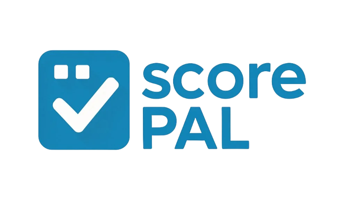

<div align="center">



# ScorePAL - AI-Powered Academic Analytics & Grading Platform

[](https://github.com/Dead-Stone/ScorePAL)
[](LICENSE)
[](https://python.org)
[](https://nextjs.org)
[](https://github.com/Dead-Stone/ScorePAL)

### ✨ Grade intelligently. Analyze comprehensively. Learn continuously.

</div>

<div align="left">

---

## What is ScorePAL?

ScorePAL is an open-source academic analytics and grading platform that helps educators grade assignments efficiently using AI, track student performance, and gain insights into learning outcomes. Connect to Canvas LMS, upload submissions, analyze performance trends, and get detailed feedback in minutes instead of hours.

**Completely free. No subscriptions. No premium plans. Just powerful grading tools for educators.**

---

## What We Do

### 🎯 **AI-Powered Grading**
Grade assignments automatically using AI. Upload student submissions, define your rubric, and get detailed feedback with consistent scoring.

### 📋 **Rubric Management**
- Generate rubrics automatically from question papers using AI
- Create custom rubrics with multiple performance levels
- Save and reuse rubrics across assignments

### 🎓 **Canvas LMS Integration**
- Connect directly to your Canvas courses
- Sync student submissions automatically
- Grade assignments and post results back to Canvas
- View student performance analytics

### 📊 **Analytics & Insights**
- Dashboard with recent gradings and course statistics
- Compare student performance across the class
- Track grades, percentiles, and trends
- Save, filter, and export grading results

### 👥 **Multi-Role Support**
- **Teachers**: Full access to grading, analytics, and course management
- **Graders**: Specialized dashboard with comparison tools
- **Students**: View their own courses, grades, and performance

### 💬 **AI Chat Assistant**
Get instant help and feedback with role-specific AI chat:
- **Teachers**: Chat about grading strategies, rubric design, and student performance insights
- **Graders**: Get guidance on consistent scoring and comparison analysis
- **Students**: Ask questions about assignments, understand feedback, and get study tips

### 🤖 **Multiple AI Providers**
Support for OpenAI, Anthropic Claude, Google Gemini, Perplexity, Hugging Face, and Cohere. Choose the AI model that works best for you.

### 📝 **File Support**
Grade PDF documents, DOCX files, Python code, Jupyter notebooks, and images. Process single submissions or batch grade entire classes.

---

## Quick Start

```bash
# Clone and setup
git clone https://github.com/Dead-Stone/ScorePAL.git
cd ScorePAL

# Install dependencies
pip install -r backend/requirements.txt
cd frontend && npm install && cd ..

# Configure environment
cp env.example .env
# Add your AI provider API key to .env

# Launch application
python start.py
```

Visit `http://localhost:3000` and start grading!

---

## How It Works

1. **Upload**: Upload question paper and student submission
2. **Configure**: Select or generate a rubric, choose AI model
3. **Grade**: AI analyzes the submission and provides detailed feedback
4. **Review**: View results, compare performance, export data

For Canvas integration, connect your Canvas account and grade directly from your courses.

---

## Tech Stack

**Frontend**: Next.js, TypeScript, Material-UI  
**Backend**: Python, FastAPI  
**AI**: Multiple providers (OpenAI, Anthropic, Google, Perplexity, Hugging Face, Cohere)  
**Integration**: Canvas LMS API

---

## 🤝 Contributing

Contributions are welcome! This is an open-source project built for educators.

---

## 📄 License

MIT License - Free to use for educational purposes.

---

## 👤 Author

**Mohana Moganti** ([@Dead-Stone](https://github.com/Dead-Stone))

Built with ❤️ for educators worldwide.
